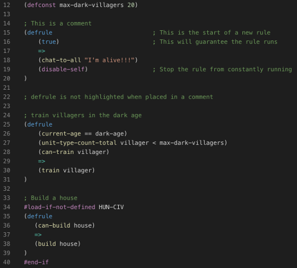
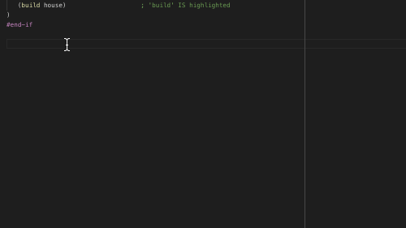

# AoE2 AiScript

This extension serves as a syntax highlighting tool for writing ai scripts in AoE2. It will apply this highlighting to any `.per` files that are loaded in vscode.

## Features

### Syntax Highlighting
This extension currently provides very rudimentary syntax highlighting as demonstrated below (image uses the `Dark+` color theme):

See [this example](syntaxes/customizing_colors.md) for how to define your own colors for the different syntax components.

### Snippets
Snippets are also provided to quickly create new rules.

### Experimental Features
These are features that are considered good enough to be tested by people, but may still need some tweaking. By default experimental features are turned off to ensure the average person has a stable experience with the extension.
To turn them on, go to the settings (`Preferences`->`Settings`), search for *'aoe2 ai script'* and set the desired feature values. You may need to reload your VSCode instance for your changes to take effect.

Current experimental features:
- Auto completion suggestions for facts, actions, units, techs, civilizations, etc...
- Command signature help text (i.e. provides parameter description as you type out the command)
- Hover help text (i.e. hover over a command or ID and it will provide information about that command or ID)

## Why ANOTHER code editor?
Building the editing features on top of Visual Studio Code offers several benefits:

- VSCode is already used by a large community of developers, meaning that it wont go away any time soon and many existing programmers should already be familiar with it.
- VSCode is cross-platform (it works on Windows, Mac and Linux)
- VSCode has many additional features which don't have to be entirely implemented from scratch, such as:
  - [code snippets](https://code.visualstudio.com/docs/editor/userdefinedsnippets)
  - [basic file editing features](https://code.visualstudio.com/docs/editor/codebasics), such as searching across all files, find-and-replace, multi-line selection and much more.
  - [syntax highlighting](https://code.visualstudio.com/api/language-extensions/syntax-highlight-guide) and user-defined [color themes](https://code.visualstudio.com/api/extension-guides/color-theme)
  - [intellisense](https://code.visualstudio.com/docs/editor/intellisense), which is a way to provide code-completion and error-checking 
- Developers of the extension can focus on the particulars of the AoE2 AI scripting language and don't have to be concerned with developing the interface.

To be clear, the original author of this code has never used or attempted to use any existing AI script editor, so this is in no way a critique of those editors.

## Known Issues
This is an alpha version after all, so there are going to be issues. For example, missing or incorrect commands/unit/building/tech IDs. If you come across a bug using the extension, please submit an issue to the github repository or via [this thread](http://forums.aiscripters.com/viewtopic.php?f=3&t=3485) on the aiscripters forums.

## Contributing
Feel free to submit issues to the github repository, and I will try to look into them when I have time.

Alternatively, for the real go-getters out there, you can fork the repository, make changes and submit a pull request!

### Contributors/Resources
The following people and resources have contributed a non-trivial amount to the development of this extension. Seriously, this extension would not be as good as it is without them:

* Scripter: Responsible for the userpatch material and related resources that are used by this extension. Whoever you are, you're a legend.
* Aleph: This guy likes complaining when things break, and I love him for it.
* AiScript resource list: The resource info derives heavily from the resource file made for AiScript
* [AoE2 wiki](https://ageofempires.fandom.com/wiki/Age_of_Empires_II:_The_Age_of_Kings): A lot of extra information for the resources was extracted from this site

## Release Notes
Please refer to the [CHANGELOG](./CHANGELOG.md) for a reference of changes in this and previous releases.

